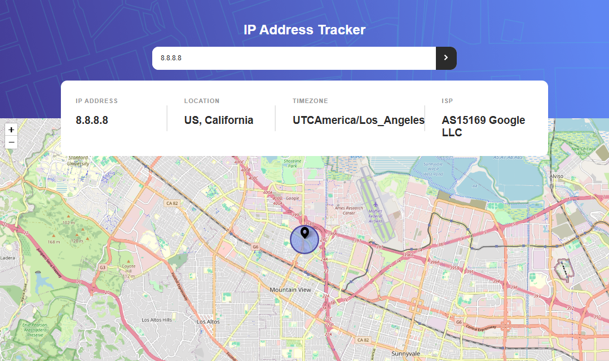
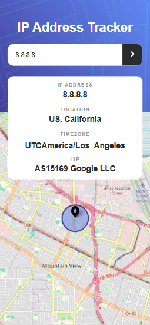

# Frontend Mentor - IP address tracker 📍🗺

This is a solution to the [IP address tracker challenge on Frontend Mentor](https://www.frontendmentor.io/challenges/ip-address-tracker-I8-0yYAH0). Frontend Mentor challenges help you improve your coding skills by building realistic projects.

## Table of contents

- [Overview](#overview)
  - [The challenge](#the-challenge)
  - [Screenshot](#screenshot)
  - [Links](#links)
- [Author](#author)

## Overview

### The challenge

- See your own IP address on the map on the initial page load
- Search for any IP addresses or domains and see the key information and location

### Screenshot

- Desktop design
  
- Mobile design
  

### Links

- Solution URL: [IP Address Tracker Repo](https://github.com/minalfatih/IP-Address-Tracker)
- Live Site URL: [IP Address Tracker Live](https://minalfatih.github.io/IP-Address-Tracker/)

## My process

### Built with

- Semantic HTML5 markup
- CSS custom properties
- Flexbox
- SASS
- Mobile-first workflow
- JavaScript
- IP Geolocation API
- LeafletJS

## Author

- Frontend Mentor - [@minalfatih](https://www.frontendmentor.io/profile/minalfatih)
- LinkedIn - [Amina Elfatih](https://www.linkedin.com/in/amina-elfatih-4aa4b0192)
